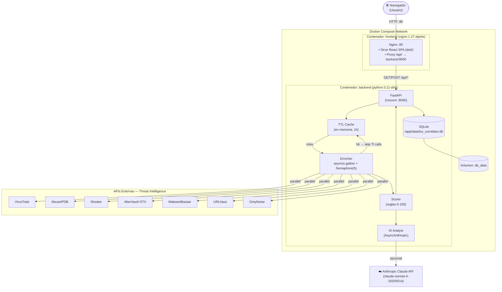
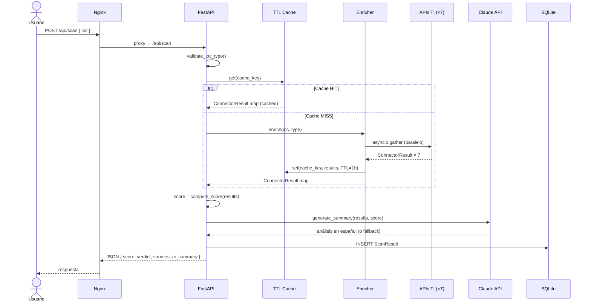

# Arquitectura Técnica

## Diagrama de arquitectura



## Flujo de una petición de escaneo



## Estructura del repositorio

```
blue-echo/
├── .gitignore
├── .env.example
├── README.md
├── docker-compose.yml
├── deploy.sh
│
├── backend/
│   ├── Dockerfile
│   ├── .dockerignore
│   ├── requirements.txt
│   ├── pytest.ini
│   ├── main.py                         # App FastAPI + lifespan
│   ├── tests/
│   │   ├── test_validators.py
│   │   ├── test_extractor.py
│   │   ├── test_database.py
│   │   ├── test_base_connector.py
│   │   ├── test_shodan.py
│   │   ├── test_otx.py
│   │   ├── test_malwarebazaar.py
│   │   ├── test_urlhaus.py
│   │   ├── test_greynoise.py
│   │   ├── test_cache.py
│   │   └── test_enricher_cache.py
│   └── ioc_correlator/
│       ├── api/
│       │   ├── routes.py               # Endpoints REST
│       │   └── schemas.py              # Pydantic models
│       ├── connectors/
│       │   ├── base.py                 # BaseConnector + ConnectorResult
│       │   ├── virustotal.py
│       │   ├── abuseipdb.py
│       │   ├── shodan.py
│       │   ├── otx.py
│       │   ├── malwarebazaar.py
│       │   ├── urlhaus.py
│       │   └── greynoise.py
│       ├── utils/
│       │   ├── validators.py           # Detección tipo IOC
│       │   └── cache.py               # Caché TTL en memoria
│       ├── extractor.py               # Parser de logs
│       ├── enricher.py               # Orquestador async + caché
│       ├── scorer.py                  # Lógica de scoring
│       ├── ai_analyst.py             # Integración Claude (AsyncAnthropic)
│       └── database.py               # SQLModel + SQLite
│
└── frontend/
    ├── Dockerfile
    ├── .dockerignore
    ├── nginx.conf
    ├── package.json
    ├── vite.config.ts
    └── src/
        ├── vite-env.d.ts
        ├── api/client.ts
        ├── components/
        │   ├── SearchBar.tsx
        │   ├── ThreatScore.tsx
        │   ├── ResultsTable.tsx
        │   ├── AiSummary.tsx
        │   ├── HistoryList.tsx
        │   └── FileUpload.tsx
        └── pages/
            ├── Dashboard.tsx
            └── History.tsx
```

## API REST

| Método | Endpoint | Descripción |
|---|---|---|
| POST | `/api/scan` | Escanea un IOC o fichero de logs |
| GET | `/api/history` | Lista los últimos 50 escaneos |
| GET | `/api/history/{id}` | Detalle completo de un escaneo |
| GET | `/api/health` | Estado del servicio |
| GET | `/api/sources` | Estado de los conectores activos |

## Reglas de Scoring

| Condición | Puntos |
|---|---|
| VT: >5 motores detectan | +30 |
| VT: 1-5 motores detectan | +15 |
| AbuseIPDB confidence >80% | +40 |
| AbuseIPDB confidence 50-80% | +25 |
| Shodan: puerto sensible abierto (22/3389/445/1433/4444) | +10 c/u, máx +30 |
| OTX: presente en pulsos activos | +20 |
| MalwareBazaar: hash conocido | +40 |
| GreyNoise: clasificado malicious | +30 |
| GreyNoise: clasificado benign | -10 |

Score máximo: 100. Veredicto: LIMPIO (0-20) · SOSPECHOSO (21-50) · MALICIOSO (51-80) · CRÍTICO (81-100).

## Decisiones de diseño relevantes

| Decisión | Motivo |
|---|---|
| Nginx sirve tanto el SPA como el proxy | Un solo puerto expuesto (80). No hay CORS porque el browser ve siempre el mismo origen. |
| Backend `expose` en lugar de `ports` | El puerto 8000 solo es accesible desde la red Docker, no desde internet. |
| TTL Cache en memoria (no Redis) | Simplicidad para práctica universitaria. Para producción real se cambiaría a Redis. |
| `AsyncAnthropic` en lugar de `Anthropic` | FastAPI es async; un cliente síncroco bloquearía el event loop. |
| `depends_on: condition: service_healthy` | El frontend no arranca hasta que el backend responde `/api/health`. |
| Multi-stage Dockerfile (builder + runtime) | La imagen final no incluye compiladores ni pip — más ligera y menos superficie de ataque. |
